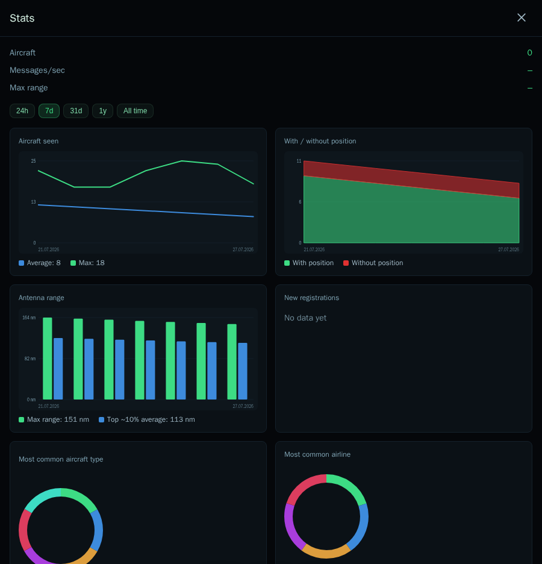
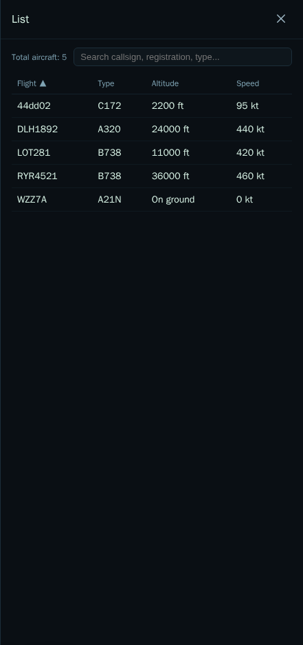

# My Local Plane Radar (MLPR)

**Version 2.0** — a self-hosted web interface for a local ADS-B receiver
running on Raspberry Pi.

MLPR reads the `aircraft.json` file produced by [readsb](https://github.com/wiedehopf/readsb)
(wiedehopf fork) and serves a live map, receiver statistics, and a rule-based
notification engine (ntfy, and now MQTT/smart-home) — without touching
readsb itself.

Live map with delta updates, signal-loss fading, altitude-colored trails, a
basemap (online or fully offline), a bottom-bar UI (List/Stats/Settings),
receiver stats with history charts, a notification engine (squawk
7500/7600/7700, first-time-seen aircraft, new range record, and a
configurable watch list matching aircraft type/registration/flight number),
an opt-in password for the Settings panel, and a systemd service for
production are all in place. See [CLAUDE.md](./CLAUDE.md) for the
architecture and [TODO.md](./TODO.md) for what's explicitly deferred.

**[Full user guide →](./docs/README.md)** — a tour of the map, the List and
Stats panels, and every Settings tab, with screenshots. For deeper,
feature-specific walkthroughs (starting with
[Smart Home / MQTT integration](https://github.com/Moris97/My-Local-Plane-Radar/wiki/Smart-Home-Integration)),
see the **[wiki](https://github.com/Moris97/My-Local-Plane-Radar/wiki)**.

<p>
  
  
</p>

## Features

- **Live map** — MapLibre GL JS vector map, aircraft drawn as one of 17
  hand-drawn shapes picked from the aircraft's actual type/category
  (airliners by size, GA, bizjets, helicopters, gliders, drones, ground
  vehicles, and more) rotating to heading, altitude-colored trails,
  configurable map labels, a pulsing receiver-location marker, online
  (detailed) or fully offline basemap, and an optional reception coverage
  overlay showing how far your receiver has actually picked up aircraft in
  each direction and altitude band.
- **Aircraft details** — click any aircraft for identity, altitude, speed,
  squawk, autopilot targets, signal quality, and (when a registration is
  known) a photo fetched directly from
  [Planespotters.net](https://www.planespotters.net/photo/api)'s free public
  Photo API — disableable in Settings → Aircraft for a fully offline setup.
- **List** — sortable, searchable table of everything currently in range.
- **Stats** — live "right now" numbers (nearest/farthest aircraft, rolling
  max range), today/all-time summaries, history charts with a doughnut ↔
  line trend toggle, antenna range/signal breakdowns, and searchable tables
  of every registration and airline ever seen, over 24h/7d/31d/1y/all-time
  ranges.
- **Notifications** — push alerts via [ntfy](https://ntfy.sh) for emergency
  squawks (7500/7600/7700), first-time-seen aircraft, new range records,
  and a configurable watch list (by type, registration, or flight number,
  with an optional altitude condition).
- **Smart home (MQTT)** — first-time-seen and watch-list events also
  publish a structured MQTT message for Home Assistant (or any other
  MQTT-speaking system) to react to — e.g. dim the lights and change their
  color when a watched aircraft type appears nearby.
- **Runs entirely on a Raspberry Pi 3** — 1 GB RAM, no Docker, no native
  dependencies, SD-card-friendly (batched writes, no raw position history).

See the [user guide](./docs/README.md) for a full walkthrough with
screenshots, or [CLAUDE.md](./CLAUDE.md) for the architecture.

## Before you start

MLPR is a **display and notification layer** — it does not talk to an SDR
dongle itself. It needs an existing, already-running
[readsb](https://github.com/wiedehopf/readsb) installation on the same
machine, producing `/run/readsb/aircraft.json`. If you don't have that yet,
set up readsb (or another ADS-B decoder you can point `MLPR_SOURCE=http` at
— see below) first; the
[wiedehopf/adsb-scripts install guide](https://github.com/wiedehopf/adsb-scripts)
is the usual starting point on a Raspberry Pi. Once `readsb` is running and
you can see aircraft in its own web page, come back here.

## Installing on a Raspberry Pi (step by step)

This is the normal path for a home install. It assumes a Raspberry Pi (3 or
newer) running Raspberry Pi OS, readsb already set up per above, and that
you're comfortable pasting commands into a terminal (over SSH or directly).
Every command below can be copy-pasted as-is.

**1. Check/install Node.js.** MLPR needs Node.js 22.13 or newer. Debian/Raspberry
Pi OS's own `apt` package is too old, so install it from NodeSource instead:

```
node --version   # if this prints v22.13.0 or higher, skip to step 2
```

If it's missing or too old:

```
curl -fsSL https://deb.nodesource.com/setup_24.x | sudo -E bash -
sudo apt-get install -y nodejs
```

**2. Download MLPR:**

```
git clone https://github.com/Moris97/My-Local-Plane-Radar.git
cd My-Local-Plane-Radar
```

**3. Run the installer:**

```
./scripts/install.sh
```

This installs MLPR's dependencies, downloads the offline basemap and airline
database (best-effort — skipped if you're offline, can be re-run later), and
sets up a systemd service (`mlpr@<your-user>.service`) that starts
automatically on every boot and restarts itself if it ever crashes. It will
ask for your `sudo` password near the end — that's expected, it's needed to
install the systemd unit.

**4. Open it in a browser.** From any device on the same network (phone,
laptop):

```
http://<your-pi's-ip-address>:1090
```

Replace `<your-pi's-ip-address>` with the Pi's LAN IP (find it with
`hostname -I` on the Pi itself). If you're on the Pi's own desktop, you can
also just use `http://localhost:1090`.

That's it — you should see the live map. If nothing shows up, check that
readsb itself is working first (its own web interface, usually port 8080),
then see **Troubleshooting** below.

### Checking on it later / updating

```
sudo systemctl status mlpr@$(whoami).service   # is it running?
journalctl -u mlpr@$(whoami).service -f        # watch live logs
git pull && sudo systemctl restart mlpr@$(whoami).service   # update to the latest version
```

### Troubleshooting

- **"Node.js not found" / "too old"** — re-run step 1's NodeSource commands,
  then re-run `./scripts/install.sh`.
- **The page loads but no aircraft ever appear** — readsb likely isn't
  writing to `/run/readsb/aircraft.json`, or MLPR is pointed at the wrong
  path. Check `journalctl -u mlpr@$(whoami).service -f` for errors, and
  confirm readsb's own web page shows live traffic. If readsb writes
  `aircraft.json` somewhere non-standard, `MLPR_AIRCRAFT_JSON_PATH` in the
  systemd unit (`systemd/mlpr@.service`) is the place to fix it.
- **No registration/aircraft type ever shows up** — `install.sh` tries to
  wire up readsb's aircraft database automatically; if that step failed
  (shown in the install output), see the `--db-file` note in
  [CLAUDE.md](./CLAUDE.md).
- **Want to see which airlines aren't recognized in the Stats registrations
  table?** MLPR logs a warning the first time it sees an airline-style
  callsign whose ICAO prefix isn't in its airline database (a fetch of
  [OpenFlights](https://openflights.org/data.php)' data, which has some
  gaps for smaller/regional carriers). Check for it with:
  ```
  journalctl -u mlpr@$(whoami).service | grep "airline-lookup"
  ```
  Each distinct prefix is only logged once per service run, not once per
  aircraft, so this won't be spammed with repeats.
- **Still stuck** — open an
  [issue](https://github.com/Moris97/My-Local-Plane-Radar/issues) with what
  you tried and the relevant `journalctl` output.

## Development (any machine, not just a Pi)

For working on MLPR itself, or trying it out without a real receiver
(`MLPR_SOURCE=replay` plays back recorded sample data):

```
npm install
./scripts/fetch-mapdata.sh   # one-time: downloads the offline basemap (~12 MB) into data/naturalearth/
npm start                    # MLPR_PORT (default 1090), MLPR_SOURCE=file|http|replay
```

Then open `http://<host>:1090/`.

## Why

Replacing a heavyweight Virtual Radar Server setup with something lightweight,
hackable, and built around one specific goal: get notified when something
interesting shows up in range (military aircraft, emergency squawks, a new
personal range record, a watched registration, ...).

## Hardware target

- **Production**: Raspberry Pi 3 (1 GB RAM, aarch64), Raspberry Pi OS Lite,
  headless, readsb running as a systemd service.
- **Development**: Debian on WSL2 (x86_64), deployed to the Pi via `git pull`
  + systemd restart.

The 1 GB RAM / SD card constraint is treated as a hard requirement throughout,
not an afterthought — see the performance rules in [CLAUDE.md](./CLAUDE.md).

## Stack

- Backend: Node.js (>=22.13.0) + Fastify + `ws`, state in memory, `node:sqlite`
  for events/aggregates only.
- Frontend: plain ES modules + [MapLibre GL JS](https://maplibre.org/) — no
  framework, no build step.
- Basemap: Natural Earth 1:10m (fetched by script, not committed).

## License

MIT — see [LICENSE](./LICENSE). Third-party dependency licenses are tracked in
[THIRD_PARTY.md](./THIRD_PARTY.md). This project only reads the JSON file
readsb writes to disk; it does not link against or embed readsb, tar1090, or
dump1090 code.

## Relationship to readsb

readsb is GPL-licensed. MLPR is a separate process that only reads the
`aircraft.json` file readsb writes to `/run/readsb/`. There is no linking, no
shared code, and no code copied from readsb, tar1090, or dump1090.
