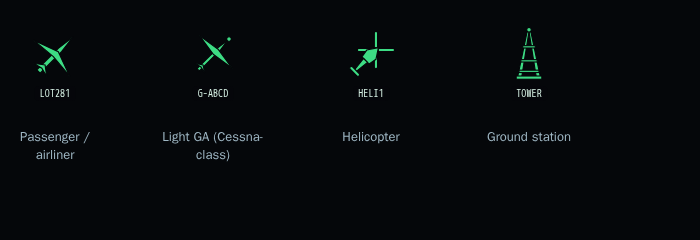
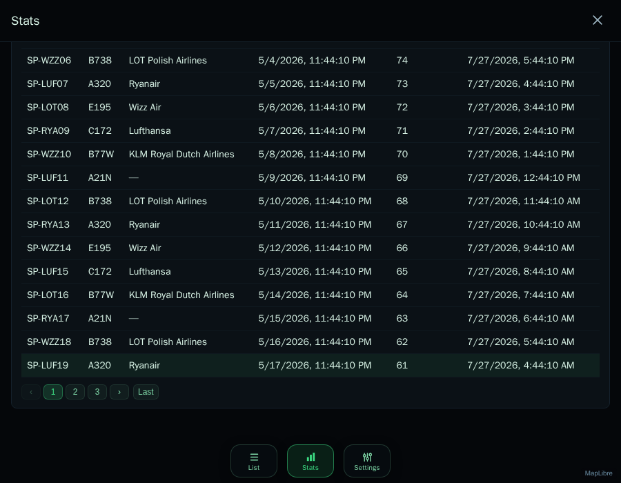
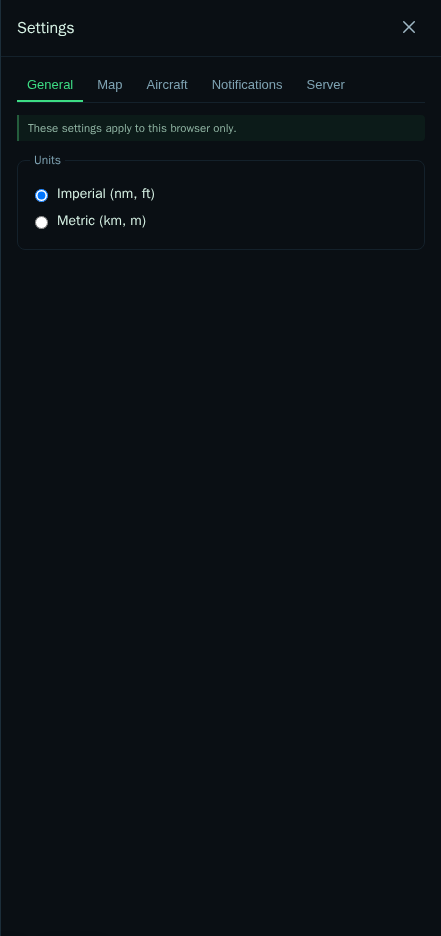
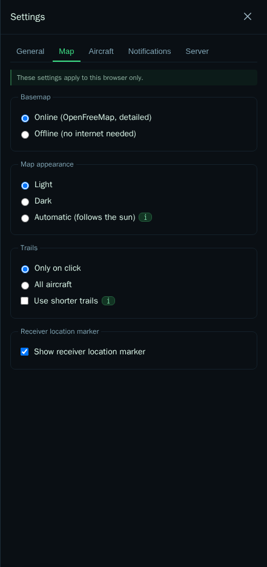
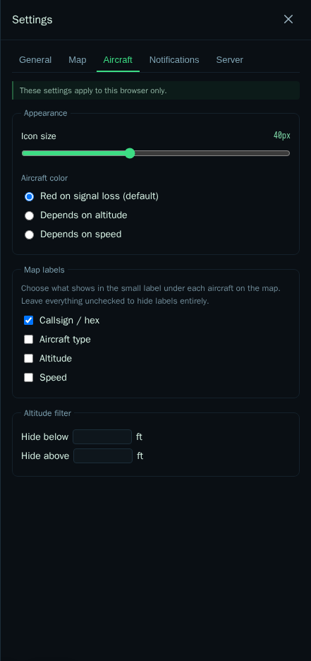
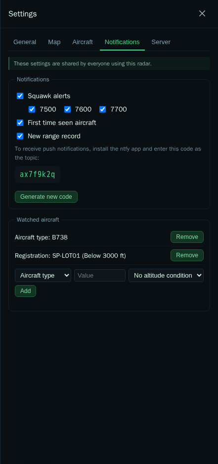
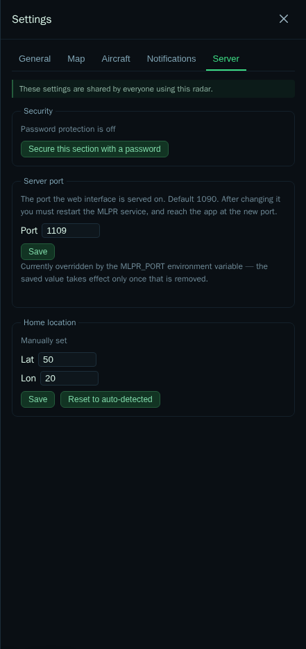

# MLPR User Guide

A tour of every screen and setting in My Local Plane Radar. If you haven't
installed MLPR yet, see the [README](../README.md) first — this guide
assumes it's already running and open in your browser.

## Contents

- [The map](#the-map)
- [Aircraft details](#aircraft-details)
- [List](#list)
- [Stats](#stats)
- [Settings](#settings)
  - [General](#general-tab)
  - [Map](#map-tab)
  - [Aircraft](#aircraft-tab)
  - [Notifications](#notifications-tab)
  - [Server](#server-tab)
  - [Backup and restore](#backup-and-restore)
- [Setting up push notifications (ntfy)](#setting-up-push-notifications-ntfy)
- [Building a watch list](#building-a-watch-list)

## The map

The map is the whole screen — there's no separate "home" page. Aircraft
appear as small plane-shaped icons that rotate to match their heading. A
bottom bar with three pill-shaped buttons (List, Stats, Settings) floats
over the map and stays reachable everywhere.

- **Click an aircraft** to select it: the icon gets a soft glow ring so you
  can keep track of it among many others, and its trail (recent flight
  path) is drawn.
- **Hover an aircraft** (or a row in the List panel) to cross-highlight it
  between the map and the list — a different visual effect from selection,
  so the two states are never confused.
- Icons **fade toward red** if an aircraft stops sending updates, and are
  removed from the map after 5 minutes of silence. If it comes back, the
  gap in its trail is drawn grey.
- Right-click-drag (map rotate/tilt) is disabled on purpose — the map
  always stays north-up and flat, like a real radar display.

Trail color follows altitude by default: green under 10,000 ft, blue in the
climb through 17,500 ft, shading to red by 30,000 ft. See
[Aircraft → Aircraft color](#aircraft-tab) to switch the *aircraft icon*
color to the same altitude scheme, or to speed instead.

Small text labels can appear under each icon (callsign by default) — what's
shown is configurable per [Aircraft tab](#aircraft-tab), and labels
automatically hide when you zoom out far enough that they'd just clutter
the screen.

## Aircraft details

Clicking an aircraft opens a small info card with the essentials (callsign,
squawk, altitude, vertical rate, speed). A **"show more fields"** button
expands it into the full details panel: heading/attitude, autopilot/FMS
targets, military/interesting/PIA/LADD flags, weather data the receiver
computed, signal quality, and the raw ICAO hex — roughly ordered from most
to least interesting to a spotter. Fields with no data for that aircraft
are simply skipped, never shown as a blank dash.

If the aircraft has a known registration, MLPR also tries to fetch a photo
from [Planespotters'](https://www.planespotters.net/) public API, shown at
the top of the panel. No match (or no registration) just means no photo —
never an error.

### Icon shapes

MLPR draws 17 hand-drawn icon shapes, picked from the aircraft's reported
type code (falling back to its ADS-B category when no type is known):
several airliner sizes (narrow-body, and three widebody variants for
twin/tri/quad-engine jets), light GA, business jets, cargo turboprops and
jets, military jets, special-mission aircraft, helicopters, gliders,
balloons, drones, ground vehicles, plus a ground-station icon for a
receiver's own antenna if it reports one, and a generic fallback for
anything that can't be classified more specifically. Size varies a little
by type too — a widebody airliner draws larger than a light aircraft even
at the same icon-size setting.



## List


A sortable table of every aircraft currently on the map: flight/callsign,
type, altitude, speed. Click a column header to sort, click a row to select
that aircraft on the map (and center on it), or use the search box to
filter by callsign, registration, or type. The total aircraft count is
shown above the table.

## Stats


A full-screen view (not a side panel, since charts need the room), organized
into sections:

- **Now** — live numbers: current aircraft count, how many have a reported
  position, messages/sec, and a rolling last-hour max range, plus two tiles
  showing the **nearest** and **farthest** aircraft currently in range
  (callsign, type, altitude, speed, distance) — computed live from your own
  browser, so it updates instantly with every map update.
- **Today** and **All time** — aircraft/flights seen, new or total unique
  registrations, max range, and most-common-type/airline doughnuts for each
  period.
- The familiar **range-selected charts** (24h / 7d / 31d / 1y / all time,
  your last choice is remembered): aircraft seen, with/without position,
  antenna range, new registrations, and most common type/airline — the
  latter two doughnuts have a **Doughnut / Line** toggle in their top-right
  corner, switching to a trend-over-time view for the top 5 types/airlines.
- **Antenna statistics** — current signal strength (if your receiver has a
  local SDR, not just a network feed), a range-by-altitude bar chart, and a
  directional coverage chart showing which compass direction your antenna
  reaches farthest in. Builds up gradually — a fresh install shows little to
  nothing at first.
- **All registrations** and **All airlines** — full, lazy-loaded (not
  fetched until you ask), sortable, paginated, searchable tables of every
  registration and airline ever seen:



## Settings

Settings is organized into six tabs. A banner at the top of each tab tells
you its scope: most tabs apply **only to this browser** (stored locally,
so your phone and laptop can have different preferences), while
**Notifications**, **Server**, and **Smart Home** are **shared by
everyone** on the radar (stored on the Pi, since they affect what gets
sent and how the app is reached).

### General tab



Just one choice: **units** — imperial (nautical miles, feet) or metric
(kilometers, meters). Applies everywhere in the app (list, stats, aircraft
details, notification messages).

### Map tab



- **Basemap**: *Online* (detailed vector map, needs internet) or *Offline*
  (no internet needed, uses a bundled world map — coastlines, borders,
  rivers, major cities — coarser detail but works with no connection at
  all). If the online map can't be reached, MLPR falls back to offline
  automatically for the rest of that browser tab.
- **Map appearance**: Light, Dark, or **Automatic** (follows sunrise/sunset
  at the receiver's location). This is the *map's* color scheme only — the
  bottom bar and panels always stay dark, since this is meant to be
  readable on a wall-mounted screen at night regardless of the map
  underneath.
- **Trails**: draw a trail for *only the selected aircraft* (default) or
  *all aircraft at once*. The **"Use shorter trails"** checkbox is a
  performance option — it caps how much trail history is kept per
  aircraft on this device, useful on a slower phone/tablet if the map
  feels sluggish with lots of traffic. Hover the "i" next to it for
  details.
- **Receiver location marker**: toggles a pulsing dot at the receiver's
  home location on the map.
- **Coverage**: off by default. Draws a shape on the map showing how far
  your receiver has actually picked up aircraft in each direction — a
  filled area (a robust average of the best reception ever recorded that
  way, resistant to one lucky contact skewing it) plus a thin dashed
  outline (the single farthest contact ever recorded in that direction).
  An altitude-band dropdown lets you look at coverage for a specific
  altitude range instead of all altitudes combined. Builds up gradually
  over time, same as the antenna statistics in Stats above.

### Aircraft tab



- **Icon size**: a slider from 24 to 64 px.
- **Aircraft color**: what the plane icon's color represents — *red on
  signal loss* (default: green, fading to red as an aircraft's data goes
  stale), *depends on altitude*, or *depends on speed*.
- **Map labels**: choose which fields appear under each aircraft icon on
  the map — callsign/hex, aircraft type, altitude, speed. Leave everything
  unchecked to hide labels entirely and keep the map clean.
- **Altitude filter**: hide aircraft below and/or above a given altitude
  (feet), useful for filtering out distant airliners at cruise if you only
  care about local traffic, or vice versa.

### Notifications tab



Turns on push notifications for interesting events, delivered via
[ntfy](https://ntfy.sh) (see [setup below](#setting-up-push-notifications-ntfy)).
First-time-seen and watch-list events can *also* trigger a smart-home
automation at the same time — see the [Smart Home tab](#smart-home-tab).

- **Squawk alerts** — an aircraft sets an emergency squawk code: 7500
  (hijack), 7600 (radio failure), 7700 (general emergency). Each code can
  be toggled independently.
- **First time seen aircraft** — notifies the first time MLPR ever
  observes a given aircraft. Note: on a brand new install, every aircraft
  currently in range will fire this notification once, since none of them
  have been "seen" before yet.
- **New range record** — a new all-time maximum reception distance.
- The **watched aircraft** list below is covered in its own section: see
  [Building a watch list](#building-a-watch-list).

### Server tab



- **Security** — off by default (this is meant for a home LAN). Turning it
  on requires a password to view or change *this tab* (server port,
  receiver location, the password itself) — everything else in Settings
  stays open, since there's no real security benefit to gating routine
  display preferences behind a login.
- **Server port** — which port the web interface is served on (default
  1090). Changing it needs an MLPR service restart, and you'll need to
  reach the app at the new port afterwards — MLPR shows you the exact new
  URL and asks you to confirm before saving, so you don't lock yourself out
  of a headless Pi by mistyping a number.
- **Home location** — MLPR auto-detects the receiver's coordinates from
  readsb's `receiver.json` at startup. You can override it manually here
  (e.g. if auto-detection picked up the wrong value, or your receiver
  doesn't report a location) — this feeds range calculations, the home
  marker, and the "automatic" map theme's sunrise/sunset calculation.
- **Backup** — see [Backup and restore](#backup-and-restore) below.

### Backup and restore

**Download backup** saves your entire install as a single `.mlpr` file.
It contains everything MLPR has: all your settings (notification rules,
watch list, smart-home broker settings, receiver location, server port,
the Settings password), *and* all the history it has accumulated — daily
statistics, every aircraft, flight and registration it has ever seen, and
the antenna coverage map. On an established install that's months of data
nothing else can recreate.

The intended use is exactly what it sounds like: export, copy the file
somewhere safe, reinstall the OS on a fresh SD card, install MLPR, click
**Restore from file**, and you're back where you were.

- **"Also include this browser's own settings"** (on by default) — units,
  language, map theme, list columns, icon size and the rest live in *this
  browser*, not on the Pi, so MLPR can only put them in the file if you
  ask it to. Leave it on for a true one-to-one restore; turn it off if the
  backup is going to a different machine whose display preferences you'd
  rather keep.
- **Restoring merges, it never deletes.** Settings are replaced by what's
  in the file; history is merged into whatever is already there, keeping
  the earliest "first seen" and the latest "last seen" on both sides. So
  restoring an old backup onto a running install can't lose data — and on
  a fresh install, merging into an empty database is simply a restore.
- After a successful restore MLPR shows how many records came back and
  offers a **Reload the page** button. Some restored settings (language,
  units) only take effect after that reload.
- **The file is compressed** — it's gzip inside, so it's typically a small
  fraction of the raw size. If you're curious what's in one,
  `gunzip -c mlpr-backup-2026-08-17.mlpr | head` shows the settings first.
- **Older backups still work.** A `.json` backup taken with MLPR 2.2 or
  earlier restores fine; it just only contains what that version saved
  (settings, no history).
- **Keep the file private.** It includes your Settings password hash and
  your smart-home broker username and password. Treat it like a password
  manager export, not like a screenshot.

You can also grab a backup without opening the browser, which makes an
automated copy easy to schedule:

```sh
curl -o mlpr-backup.mlpr http://<pi-address>:1090/api/settings/export
```

(If you've set a Settings password, add
`-H "X-MLPR-Settings-Token: <token>"` — that endpoint is protected along
with the rest of the Server tab.)

What is *not* in the backup, because it doesn't need to be: the map data
and airline name database (the install script fetches those), and live
aircraft state, which is by design never stored at all.

### Smart Home tab

Protected by the same Security setting as the Server tab, since a broker
username/password is a real infrastructure credential, not a routine
display preference.

**New to MQTT?** See the
[Smart Home (MQTT) Integration wiki guide](https://github.com/Moris97/My-Local-Plane-Radar/wiki/Smart-Home-Integration)
for a full walkthrough — getting a broker running (Home Assistant add-on
or Docker), connecting both MLPR and Home Assistant to it, verifying
messages arrive, building your first automation, and a troubleshooting
checklist for the errors people actually hit doing this for the first
time. The summary below covers just what each field in this tab does.

- **Enable smart-home (MQTT) notifications** — publishes a message
  whenever a first-time-seen or watch-list notification fires, for a home
  automation system (tested against [Home Assistant](https://www.home-assistant.io/))
  to react to.
- **Broker URL** — e.g. `mqtt://192.168.1.50:1883`, or `mqtts://host:8883`
  for a TLS connection. Username/password are optional, depending on your
  broker's configuration.
- **Topic prefix** — defaults to `mlpr`. Events publish to
  `<prefix>/events/first_seen` and `<prefix>/events/watchlist`;
  availability (whether MLPR is currently connected) to `<prefix>/status`.
- **Test connection** — verifies the broker accepts the given address/
  credentials before you save them.

Each event is a JSON message with the aircraft's hex, flight, registration,
type, altitude, ground speed, and position (when known) — for a watch-list
event, also which watch-list entry matched. See
[Setting up push notifications](#setting-up-push-notifications-ntfy) for
the equivalent phone-notification setup; smart-home and ntfy are two
independent, simultaneous delivery channels for the same underlying
first-seen/watch-list events.

## Setting up push notifications (ntfy)

1. Open Settings → Notifications and turn on the events you want.
2. Install the free [ntfy](https://ntfy.sh) app on your phone (Android/iOS)
   or use it in a browser.
3. In ntfy, subscribe to the topic code shown in MLPR's Notifications tab
   (an 8-character code like the one in the screenshot above — yours will
   be different). Treat it like a password: anyone who knows it can read
   your notifications, since ntfy's public topics aren't private by
   default.
4. That's it — matching events now push a notification to your phone,
   including a tap-to-open link back into MLPR when possible.

You can regenerate the topic code at any time from the same tab (e.g. if
you think it's leaked) — you'll need to re-subscribe in ntfy afterwards.

## Building a watch list

The watch list lets you get notified about *specific* aircraft, independent
of the general rules above. Each entry matches on one of:

- **Aircraft type** (e.g. `B738`) — matches any aircraft of that type.
- **Registration** (e.g. `SP-LOT01`) — matches one specific airframe.
- **Flight / callsign** (e.g. `RYR4521`) — matches a specific flight number.

Matching is case-insensitive. Each entry can optionally add an altitude
condition (*below* / *above* a given feet value) — useful for something
like "notify me about this type, but only when it's low enough to actually
be worth looking up at." If the needed altitude data isn't available for a
given contact, the condition simply doesn't match — you'll never get a
false positive from missing data.

Add entries from Settings → Notifications → Watched aircraft; each has its
own **Remove** button once added.
